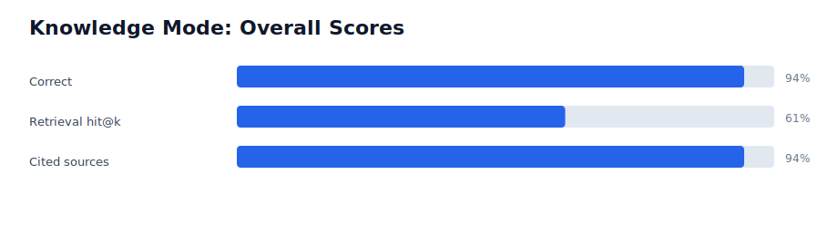
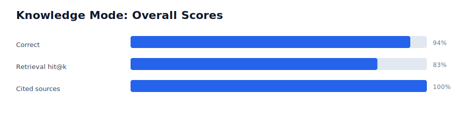
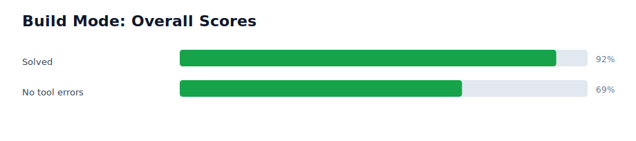
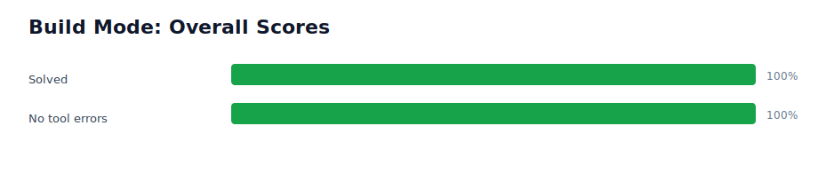
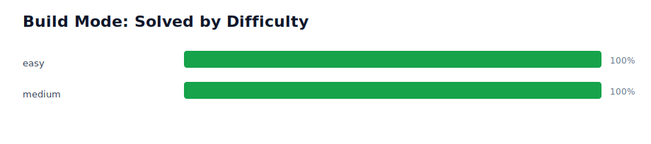
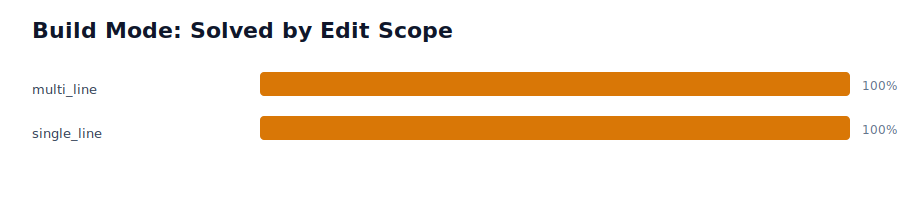
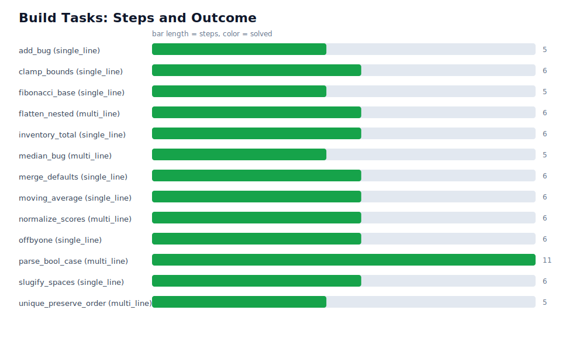
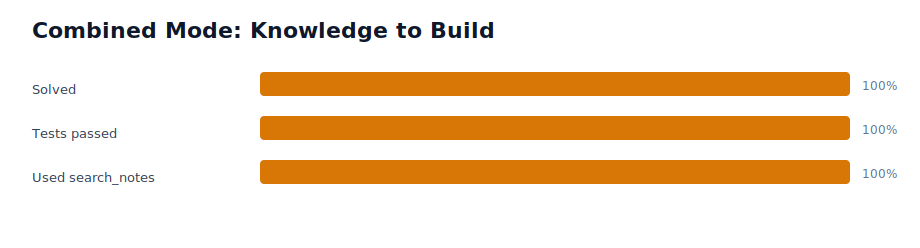
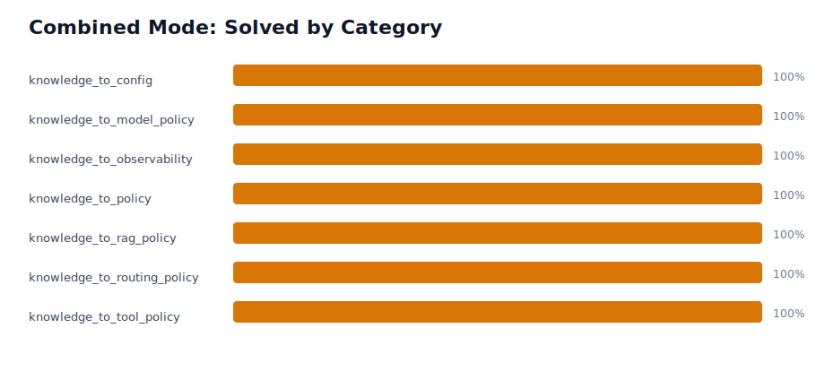

## Models on ollama

| Model Size (Parameters) | Estimated Memory Required | Example Models | Recommended Hardware |
| :--- | :--- | :--- | :--- |
| **1B - 3B** | 2 GB - 4 GB | Qwen 2.5 (1.5B), Phi-3 (3.8B) | Any modern laptop, Raspberry Pi, basic CPU. |
| **7B - 9B** | 6 GB - 8 GB | Llama 3.1 (8B), Mistral (7B), Gemma 2 (9B) | 8GB+ VRAM GPU (RTX 3060/4060) or 8GB+ Unified Memory (Mac M1/M2/M3). |
| **13B - 14B** | 10 GB - 12 GB | Qwen 2.5 (14B) | 12GB+ VRAM GPU (RTX 3060 12GB / 4070) or 12GB+ Mac. |
| **30B - 34B** | 20 GB - 24 GB | Command R (35B), Yi (34B) | 24GB VRAM GPU (RTX 3090/4090) or 24GB+ Mac. |
| **70B - 72B** | 40 GB - 48 GB | Llama 3.1 (70B), Qwen 2.5 (72B) | Dual RTX 3090s/4090s, Mac Studio with 48GB+ Unified Memory, or heavy system RAM (CPU mode). |


## Phase. 0 

```
Agent = LLM + Instructions + State + Tools + Execution Loop 
```

```
User prompt
    ↓
Agent loop
    ↓
LLM decides what to do
    ↓
Runtime interprets the decision
    ↓
Runtime executes a tool
    ↓
Tool result is returned to the LLM
    ↓
LLM decides whether to act again or answer
```

We have to make a ReAct loop here, ReAct stands for reasoning and acting. In Atelier, the loop is described as:

```
perceive → plan → act → observe
```

### Percieve 
The model recieves the current state:
1. original user goal
2. system instructions
3. available tool descriptions
4. previous tools observations


### Plan

The model decides what the next step should be.

### Act 

The model chooses a tool and executes it.


### Observe

Your Python runtime executes the calculator and creates an observation:


## Phase 0 System

```
                         ┌──────────────────────┐
User goal ──────────────▶│      loop.py         │
                         │                      │
                         │  maintain messages   │
                         │  call model          │
                         │  parse output        │ 
                         │  execute tool        │
                         │  append observation  │
                         │  detect completion   │
                         └──────────┬───────────┘
                                    │
                                    ▼
                         ┌──────────────────────┐
                         │      brain.py        │
                         │                      │
                         │ local model client   │
                         │ Ollama or MLX        │
                         └──────────────────────┘
                                    │
                                    ▼
                         ┌──────────────────────┐
                         │ Local Qwen3-8B model │
                         └──────────────────────┘
                         
```


1. `brain.py` : It is a direct translational bridge between our python code and the local Ollama server. It exposes a single interface function `ask_model`  that allows agent to talk to the model.

2. `calculator.py` : Here we make use of Python's abstract syntax tree (`ast`) module to inspect and run the math safely.

3. **Division of Labor (LLM vs. Python Runtime)**:

| Step | Who Does It? | What Happens? | Example |
| :--- | :--- | :--- | :--- |
| **1. Request** | User | You ask the agent a math question. | *"What is 3817 * 94?"* |
| **2. Reasoning** | **LLM (Brain)** | The model reads the question and realizes: *"I cannot do this math reliably. I should use my `calculator` tool."* | Emits: `CALCULATE: 3817 * 94` |
| **3. Execution** | **Python (Hand)** | The `loop.py` script intercepts the model's text, extracts `3817 * 94`, and runs it through [calculator.py](file:///Users/monitsharma/code_projects/atelier/agent/calculator.py). | Evaluates and returns: `358798` |
| **4. Observation** | **Python (Hand)** | The execution result is appended to the chat history as a new message. | Added to chat: `Observation: 358798` |
| **5. Synthesis** | **LLM (Brain)** | The model reads the observation and formulates a conversational final answer. | Emits: *"3817 * 94 is 358798."* |


---

## Phase 1

```
Qwen asks for a tool
        ↓
Tool registry checks whether it exists
        ↓
Arguments are validated
        ↓
Correct tool is executed
        ↓
Structured result is returned
```


The architecture for Phase 1 becomes:

```
                    ┌───────────────┐
                    │     Qwen      │
                    └───────┬───────┘
                            │
                    structured tool call
                            │
                    ┌───────▼───────┐
                    │   agent loop   │
                    └───────┬───────┘
                            │
                     tool dispatcher
                            │
             ┌──────────────┼──────────────┐
             │              │              │
        ┌────▼────┐    ┌────▼────┐    ┌────▼────┐
        │  files  │    │ code exec│    │ search  │
        └─────────┘    └──────────┘    └─────────┘
                            │
                       ┌────▼────┐
                       │  shell  │
                       └─────────┘
```


Now we have to add a function of `read_file`, so that our AI agent can read the file too but the model must not be allowed to read arbitrary files from the system, like

```
/Users/monitsharma/.ssh/id_rsa
```

This bad ,but

```
Project.md
agent/loop.py
tools/registry.py
```

this is good.

So the file tool should only read files inside the project workspace. So we will buld it. 

---

## Notes from Eval Expansion and Reliability Work

Date: 2026-06-22

These are my working notes for what changed after the expanded eval run.

### The expanded eval result

I ran:

```bash
atelier eval --mode all
atelier eval-plots
```

The expanded eval suite now has:

| Suite | Count | What it checks |
| :--- | ---: | :--- |
| Doc-QA | 18 tasks | Can Atelier answer questions from the project docs and cite sources? |
| Code repair | 13 tasks | Can Atelier fix small Python bugs and prove it with pytest? |

The result was:

| Metric | Result |
| :--- | :--- |
| Doc-QA correctness | 94% (17/18) |
| Doc-QA citations | 94% (17/18) |
| Doc-QA retrieval hit | 61% |
| Code tasks solved | 92% (12/13) |
| Single-line edits | 100% (8/8) |
| Multi-line edits | 80% (4/5) |

The important result is not just the headline score. The important result is the
shape of the failures.

Atelier is now very reliable on simple single-line code repairs:

```text
arithmetic bugs
off-by-one bugs
normalization bugs
small mutation bugs
simple API misuse bugs
```

The remaining weak area is:

```text
multi-line structural Python edits
```

The one failed task was still:

```text
median_bug
```

That task needs the function body to change from a simple one-line return into
branching logic for odd/even list lengths. This is exactly the type of edit where
plain text replacement is fragile.

### Why median_bug matters

The median function starts as something like:

```python
def median(xs):
    xs = sorted(xs)
    n = len(xs)
    return xs[n // 2]
```

This works for odd-length lists, but it is wrong for even-length lists.

The correct shape is:

```python
def median(xs):
    xs = sorted(xs)
    n = len(xs)
    if n % 2:
        return xs[n // 2]
    return (xs[n // 2 - 1] + xs[n // 2]) / 2
```

This is not a hard programming problem, but it is hard for a local 14B agent
using text edits because the model must:

1. find the right function,
2. replace several lines,
3. keep indentation valid,
4. avoid damaging nearby code,
5. run tests,
6. recover if pytest fails.

This is why the next real engineering step was not "make the model smarter".
The next real step was to give the agent a better edit tool.

### Why I added ast_edit

Before this change, Atelier had:

```text
write_file
edit_file
```

`edit_file` is safe for small edits because it replaces one exact unique string.
But for multi-line Python changes, it is fragile. The model has to write the
exact old text and the exact new indentation.

So I added:

```text
ast_edit
```

The job of `ast_edit` is:

```text
path + function name + new function body -> safely replace that function body
```

Example tool input:

```json
{
  "path": "statsutils.py",
  "function_name": "median",
  "new_body": "xs = sorted(xs)\nn = len(xs)\nif n % 2:\n    return xs[n // 2]\nreturn (xs[n // 2 - 1] + xs[n // 2]) / 2"
}
```

The tool handles indentation itself. The model does not need to perfectly align
every line against the surrounding file.

The tool also compile-checks the result before writing it. If the replacement
would create invalid Python, it refuses to write.

That gives the agent a safer path for structural edits:

```text
repo_map -> read_file -> ast_edit -> test_runner
```

instead of:

```text
repo_map -> read_file -> fragile multi-line edit_file -> test_runner
```

### How ast_edit works internally

The implementation uses Python's built-in `ast` module.

It does this:

1. Resolve the file path and make sure it is inside the workspace.
2. Parse the Python file with `ast.parse`.
3. Find exactly one function with the requested name.
4. Find the line range of that function's body.
5. Indent the new body to match the function.
6. Build the new file text.
7. Run `compile()` on the new text.
8. Only write the file if the compile check passes.

This is the key design point:

```text
The model decides what the new function body should be.
Python handles the structural replacement safely.
```

That is the same design pattern as the calculator tool:

```text
LLM decides intent.
Python runtime performs the precise operation.
```

### Retrieval metric issue

The expanded doc-QA run had:

```text
94% correctness
61% retrieval hit
```

At first this looks bad, but the answers were mostly correct.

The problem is that the old metric allowed only one expected source per question:

```json
"expected_source": "docs/ARCHITECTURE.md"
```

But many facts are repeated across:

```text
README.md
Project.md
docs/ARCHITECTURE.md
docs/EVAL.md
docs/TESTING.md
docs/WRITEUP.md
```

So an answer can be correct and grounded, but still fail retrieval_hit because
it retrieved a different valid source.

I changed the metric to also support:

```json
"expected_sources": ["docs/ARCHITECTURE.md", "README.md"]
```

This keeps the metric explicit, but makes it fairer.

### What I should fine-tune on next

The fine-tune should not try to make the small model write full patches yet.
That is too ambitious for the current data size.

The best fine-tune target is:

```text
task -> task type + difficulty + edit scope + tool plan + model route
```

Example:

```text
Input:
Fix median_bug.

Output:
category: structural_logic
difficulty: medium
edit_scope: multi_line
tool_plan: repo_map -> read_file -> ast_edit -> test_runner
model: qwen3:14b
```

Another example:

```text
Input:
Fix moving_average.

Output:
category: off_by_one
difficulty: easy
edit_scope: single_line
tool_plan: repo_map -> read_file -> edit_file -> test_runner
model: qwen3:4b
```

This helps the system decide:

1. Which model should handle the task?
2. Which tool should be used for the edit?
3. Is this a risky multi-line change?
4. Should it use `edit_file` or `ast_edit`?

### Next milestone

The next clean milestone is:

```text
Rerun the expanded eval and get median_bug passing.
```

If `median_bug` passes, then the code suite can move from:

```text
92% solved
```

to:

```text
100% solved
```

That would be a strong result because it would show that the failure was not
only a model limitation. It was partly a tool-design limitation.

### What actually fixed median_bug after adding ast_edit

After adding `ast_edit`, I reran only the `median_bug` code eval task.

First attempt:

```text
solved: 0
steps: 12
tool_errors: 2
failure: pytest collection / syntax problem
```

The trace showed that the agent did not use `ast_edit`. It kept using
`edit_file` and broke indentation.

Then I made the tool policy stronger:

```text
If a Python fix changes more than one line inside a function body, use ast_edit,
not edit_file.
```

But the next run still failed for a different reason. The trace showed the agent
was confused by paths.

The root cause was:

```text
repo_map showed paths relative to the mapped task directory,
but read_file expects workspace-relative paths.
```

Example:

```text
repo_map showed:
statsutils.py

but read_file needed:
.eval_workspace/median_bug/statsutils.py
```

So I changed `repo_map` to show workspace-relative paths. I also updated the eval
task prompts to say:

```text
Use the workspace-relative file paths shown by repo_map.
```

After that, `median_bug` passed:

```text
solved: 1
steps: 5
tool_errors: 0
test_summary: 100%
```

Interesting detail: the successful run used `edit_file`, not `ast_edit`.

So the lesson is:

```text
The failure was not only multi-line editing.
It was also bad path handoff between repo_map and read_file.
```

Current conclusion:

1. `repo_map` must show paths that can be copied directly into `read_file`,
   `edit_file`, and `ast_edit`.
2. `ast_edit` is still useful as a safer tool for structural function-body
   rewrites.
3. The next full verification should be a complete `atelier eval --mode code`
   rerun to confirm whether the code suite moves from 92% to 100%.

### Full code eval after the path fix

After fixing `repo_map` paths and updating the eval prompts, I reran:

```bash
atelier eval --mode code
atelier eval-plots
```

The new report was:

```text
data/eval_reports/report_20260621T171954.json
```

The result:

```text
code solved: 100%
average steps: 5.8
average tool errors: 0.0
```

This is the clean before -> intervention -> after table:

| Stage | What was measured | Result | What it meant |
| :--- | :--- | :--- | :--- |
| Small baseline | 3 code tasks | 67% solved (2/3) | Single-line fixes worked, but `median_bug` failed. |
| Expanded eval before fix | 13 code tasks | 92% solved (12/13) | The agent was broadly useful, but `median_bug` still exposed a reliability boundary. |
| Failure analysis | Trace inspection | `median_bug` used bad paths and fragile edits | The problem was not only model reasoning. Tool handoff was confusing the agent. |
| Tooling change 1 | Added `ast_edit` | New safe option for multi-line function edits | The system now has a structural edit tool when text edits are risky. |
| Tooling change 2 | Fixed `repo_map` paths | Paths are now workspace-relative | The agent can copy paths directly into `read_file`, `edit_file`, and `ast_edit`. |
| Prompt change | Updated code eval prompts | Prompts say to use repo_map's workspace-relative paths | The agent is less likely to call tools with wrong paths. |
| Targeted rerun | `median_bug` only | solved in 5 steps, 0 tool errors | The exact previous failure now passes. |
| Full rerun after fix | 13 code tasks | 100% solved (13/13), avg 5.8 steps, 0.0 tool errors | Build mode is now reliable on this expanded single-file repair suite. |

Breakdown after the fix:

| Slice | Result |
| :--- | :--- |
| Easy tasks | 100% solved |
| Medium tasks | 100% solved |
| Single-line edits | 100% solved |
| Multi-line edits | 100% solved |
| Structural logic tasks | 100% solved |
| Tool errors | 0.0 average |

The key lesson:

```text
Reliability improved because the tools became easier for the model to use.
```

This is important because it shows the project is not just "waiting for a better
model". A local 14B model can perform much better when the tool interface is
designed around its limits.

### What I should do next after 100% code eval

Now that the code suite is at 100%, I should not immediately add random features.
The next step should increase credibility.

Best next steps:

| Rank | Next task | Why |
| :--- | :--- | :--- |
| 1 | Update README and eval plots with the 100% code result | The public project should show the current result, not the older 92% result. |
| 2 | Run full `atelier eval --mode all` again | Code is fixed, but I should also remeasure doc-QA after the retrieval metric improvement. |
| 3 | Add combined knowledge -> build eval tasks | This is the real promise of Atelier: use notes and then modify code. |
| 4 | Build planner-router dataset from eval metadata and traces | This becomes the right fine-tuning dataset. |
| 5 | Fine-tune the small model on task classification + tool plan prediction | The model should learn when to use `edit_file`, `ast_edit`, worker, brain, or heavy. |

My next engineering milestone should be:

```text
Combined eval suite:
search_notes -> decide implementation rule -> edit code -> run tests
```

Example combined task:

```text
Use my project notes to find the preferred testing framework, then add a pytest
test for a utility function and prove it passes.
```

This matters because current code eval tests build mode alone. The combined eval
would test whether the two halves of Atelier actually compose.

### Latest full eval with plots

After the code-only 100% run, I ran the full eval again:

```bash
atelier eval --mode all
atelier eval-plots
```

The report was:

```text
data/eval_reports/report_20260621T173650.json
```

The plot assets are here:

```text
docs/assets/eval/report_20260621T173650/
```

Current full-run result:

| Metric | Previous expanded run | Current full run | Change |
| :--- | :--- | :--- | :--- |
| Doc-QA correctness | 94% | 94% | Stable |
| Doc-QA retrieval hit | 61% | 83% | Better after allowing multiple valid sources |
| Doc-QA citations | 94% | 100% | Better |
| Code solved | 92% | 100% | Fixed after repo_map path change |
| Average code steps | 6.5 | 6.1 | Slightly better |
| Average tool errors | 0.3 | 0.0 | Fixed |

The most useful plots to look at:















Interpretation:

```text
The project moved from "mostly reliable but one structural failure" to
"100% reliable on the current code-repair suite".
```

The doc-QA side is also better, but not perfect:

```text
correctness: 94%
retrieval hit: 83%
citations: 100%
```

The remaining doc-QA misses are now more about eval sharpness and retrieval
coverage than basic agent failure.

### Combined knowledge -> build eval tasks added

The next suite tests whether the two halves of Atelier compose.

Old eval shape:

```text
Knowledge mode: answer questions from notes
Build mode: fix code using tests
```

New combined eval shape:

```text
search_notes -> retrieve a project/user decision -> edit code -> run tests
```

I first added three combined tasks:

| Task | Knowledge needed | Code change |
| :--- | :--- | :--- |
| `license_preference` | User prefers Apache-2.0 | Change package license from MIT to Apache-2.0 |
| `testing_preference` | User prefers pytest | Change test framework setting from unittest to pytest |
| `locality_constraint` | Project forbids cloud APIs | Change runtime policy from cloud allowed to cloud disallowed |

Important scoring rule:

```text
Combined task only counts as solved if:
1. tests pass, and
2. the trace used search_notes.
```

This matters because otherwise the agent could accidentally pass by treating the
task like a normal code task. The combined suite forces actual knowledge use.

Then I broadened the suite to 10 combined tasks:

| Task | Knowledge needed | Code behavior checked |
| :--- | :--- | :--- |
| `license_preference` | Preferred license | Return Apache-2.0 |
| `testing_preference` | Preferred test framework | Return pytest |
| `locality_constraint` | No cloud APIs | Return cloud disabled |
| `brain_model_policy` | Default brain model | Return qwen3:14b |
| `embedding_model_policy` | Embedding model choice | Return BAAI/bge-base-en-v1.5 |
| `vector_store_policy` | Vector store choice | Return ChromaDB |
| `trace_path_policy` | Trace output location | Return data/traces |
| `report_path_policy` | Eval report location | Return data/eval_reports |
| `edit_tool_policy` | Multi-line edit tool policy | Return ast_edit for multi-line edits |
| `router_policy` | Planner-router policy | Route easy/single-line to worker, medium/multi-line to brain, combined to brain |

The first 3-task smoke run passed. Then I ran the full 10-task suite and used
that result as the real combined benchmark.

### Planner-router fine-tuning data created

I also created planner-router data from the real eval metadata.

Command:

```bash
python models/router/make_planner_dataset.py
```

Output:

```text
models/router/data/planner_router.jsonl
models/router/data/planner_train.jsonl
models/router/data/planner_valid.jsonl
models/router/data/planner_test.jsonl
models/router/planner_data/train.jsonl
models/router/planner_data/valid.jsonl
models/router/planner_data/test.jsonl
```

Dataset size after broadening combined eval:

| Source | Rows |
| :--- | ---: |
| Doc-QA tasks | 18 |
| Code tasks | 13 |
| Combined tasks | 10 |
| Total | 41 |

MLX LoRA split:

| Split | Rows |
| :--- | ---: |
| train | 32 |
| valid | 4 |
| test | 5 |

Each row teaches:

```text
task -> category, difficulty, edit_scope, tool_plan, model_route
```

Example output shape:

```json
{
  "category": "structural_logic",
  "difficulty": "medium",
  "edit_scope": "multi_line",
  "tool_plan": ["repo_map", "read_file", "ast_edit", "test_runner"],
  "model_route": "brain"
}
```

This is the right fine-tuning target because it teaches the small model how to
route and plan inside Atelier. It does not ask the small model to write complete
patches yet.

Fine-tune command:

```bash
make train-planner-router
```

This uses `models/router/planner_data/` and writes a separate adapter to:

```text
models/router/planner_adapter/
```

### Combined eval live result

I ran:

```bash
atelier eval --mode combined
atelier eval-plots --report data/eval_reports/report_20260622T011056.json
```

The latest report is:

```text
data/eval_reports/report_20260622T011056.json
```

The full 10-task combined suite passed:

| Task | Knowledge retrieved | Code change | Result |
| :--- | :--- | :--- | :--- |
| `license_preference` | User prefers Apache-2.0 | Change license value | Passed |
| `testing_preference` | User prefers pytest | Change test framework value | Passed |
| `locality_constraint` | Cloud APIs are not allowed | Change runtime policy value | Passed |
| `brain_model_policy` | Default brain model is qwen3:14b | Change model policy value | Passed |
| `embedding_model_policy` | Embedding model is BAAI/bge-base-en-v1.5 | Change embedding policy value | Passed |
| `vector_store_policy` | Vector store is ChromaDB | Change vector store value | Passed |
| `trace_path_policy` | Traces are written to data/traces | Change trace path value | Passed |
| `report_path_policy` | Eval reports are written to data/eval_reports | Change report path value | Passed |
| `edit_tool_policy` | Multi-line edits should use ast_edit | Change edit tool logic | Passed |
| `router_policy` | Combined and medium multi-line work routes to brain | Change routing logic | Passed |
| **Overall** | `search_notes` required | pytest required | **100% (10/10)** |

Aggregate:

| Metric | Result |
| :--- | :--- |
| Combined solved | 100% |
| Tests passed | 100% |
| Used `search_notes` | 100% |
| Average steps | 6.7 |
| Tool errors | 0.0 |

Plots:





This is important because it proves the two parts of Atelier compose:

```text
knowledge retrieval + code editing + test verification
```

The useful story from this run is the before -> fix -> after:

| Stage | Result | What happened | What I changed |
| :--- | :--- | :--- | :--- |
| 3-task smoke run | 100% (3/3) | Basic knowledge -> config edits worked | Added confidence that the two modes compose |
| First 10-task run | 90% (9/10) | `router_policy` failed; trace showed repeated `ast_edit` syntax errors from mixed indentation | Improved `ast_edit` body normalization |
| Targeted rerun | `router_policy` passed | The same task passed in 8 steps with 0 tool errors | Verified the exact failure was fixed |
| Full 10-task rerun | 100% (10/10) | Every task passed, every task used `search_notes`, tool errors stayed 0.0 | This is the current combined benchmark |

The `router_policy` failure was valuable because it showed another local-model
interface issue. The model's intended logic was mostly right, but it supplied a
function body with this shape:

```text
first line: no indentation
later sibling lines: still carrying one function-body indent
```

Plain `textwrap.dedent()` cannot fix that pattern because the first line has
zero indentation. I changed `ast_edit` so it tries safe body normalizations and
writes only the first candidate that makes the whole Python file compile.

This keeps the same safety rule:

```text
No compile check, no write.
```

Current conclusion:

```text
Atelier now passes the current doc-QA, code, and combined benchmark slices well
enough to move to planner-router fine-tuning.
```
